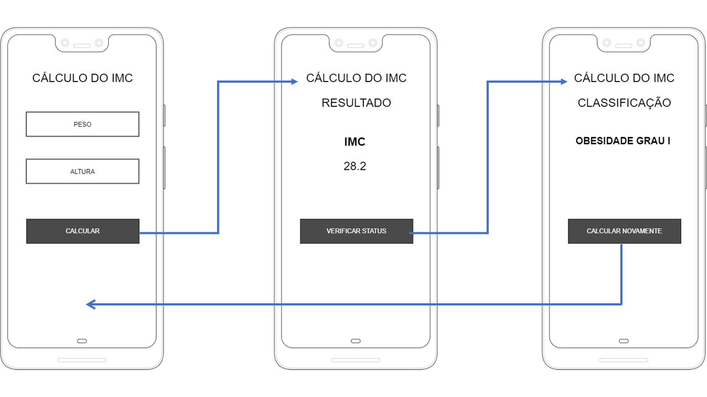

## Atividade Individual
Desenvolver uma **Calculadora de IMC** que utilize o conceito de **Views, Bundles e Intents**, conforme a figura abaixo. Utilize a tabela mostrada na figura 2 para apresentar o resultado da classificação do cálculo.

**Requisitos:**
+ Coletar os dados na View 1
+ Calcular o IMC (*vide equação abaixo*) na View 2
+ Mostrar o resultado nutricional na View 3

## Equação para o Cálculo do IMC
 

	

## Tabela de Classificação Nutricional

	

